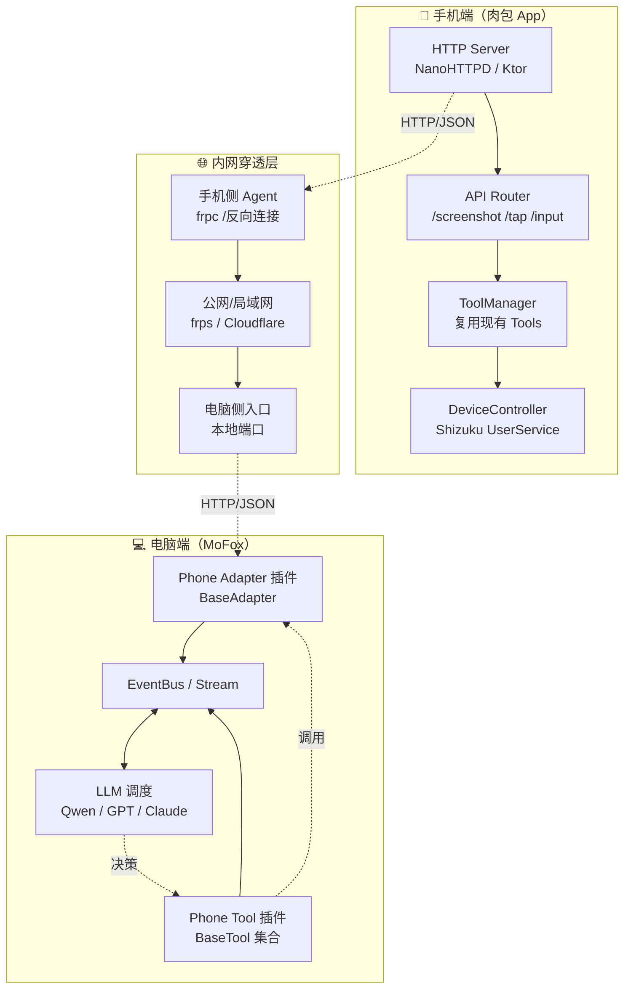
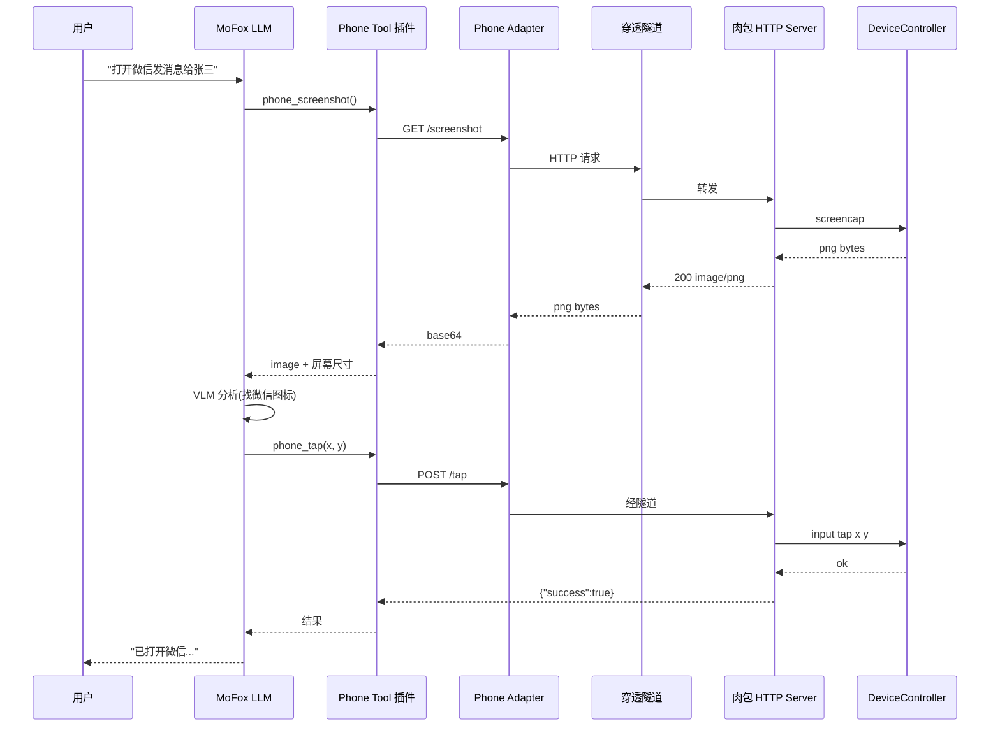

# 第 2 章 · 总体架构

## 2.1 架构全景



## 2.2 角色划分

### 手机端（肉包）

**定位：被控执行器。** 只负责「执行指令、返回结果」，不做高层决策。

职责：

- 暴露 HTTP API（截图、点击、滑动、输入、打开 App、Shell 等）
- 复用现有 `ToolManager` / `DeviceController` / `AppScanner`
- 执行命令白名单与安全熔断

不职责：

- **不跑任何 Agent / VLM**（决策与多步编排全部在 MoFox 侧）
- 不负责多步任务编排（交给 MoFox 的 LLM）
- 不负责跨手机调度
- 不负责向 MoFox 主动上报（被动等调用，除非事件订阅场景）

### 网络层（穿透）

**定位：透明管道。** 只做字节转发，不解析业务。

职责：

- 把手机 `127.0.0.1:port` 映射到电脑可达地址
- 提供鉴权（TLS / Token）防止被外部访问
- 断线重连

### 电脑端（MoFox）

**定位：控制大脑。** 负责理解意图、规划步骤、调用手机执行。

职责：

- 通过 `Phone Adapter` 维持与肉包的长连接 / 会话
- 通过 `Phone Tool` 把手机能力暴露给 LLM（如 `phone_screenshot` `phone_tap`）
- LLM 决策后调用 Tool -> Adapter -> HTTP -> 手机
- 复用 MoFox 的事件总线、流驱动、记忆系统

## 2.3 集成形态：Tool 集成（单一形态）

把肉包的每个原子操作注册为 MoFox 的 `BaseTool`，LLM 像调用普通工具一样调用手机。**Agent 全部在电脑端 MoFox 运行，肉包只暴露原子 API，不跑任何 Agent/VLM。**

```
用户: "帮我在美团点份猪脚饭"
  ↓ MoFox LLM
  tool_call: phone_screenshot()
  tool_call: phone_find_app("美团")
  tool_call: phone_open_app("美团")
  tool_call: phone_screenshot()
  tool_call: phone_tap(x, y)
  ...
```

特点：

- **LLM 主导**，每一步都由 LLM 决策
- 灵活，可处理任意新任务
- Token 消耗高（每步都要带截图给 LLM）
- 肉包侧零智能，只做「手」，所有「脑」在 MoFox

## 2.4 数据流（Tool 集成详图）



## 2.5 关键设计决策

### 决策 1：HTTP 而非 WebSocket / gRPC

- **选 HTTP**：肉包已是 Kotlin/Android，`HttpURLConnection` 与 NanoHTTPD 成熟；MoFox 侧 `httpx` 调用简单；穿透工具对 HTTP 友好。
- WebSocket 仅在未来「事件推送」「长任务进度」场景才考虑引入（本期不实现，第 6 章仅定义原子操作的请求/响应契约）。
- gRPC 在 Android 端依赖较重，本期不引入。

### 决策 2：截图走 HTTP Body 而非文件 URL

避免手机起文件服务器带来的权限与清理问题。截图直接以 `image/png` 二进制返回，MoFox 侧转 base64 喂给 VLM。大图可选 JPEG 压缩参数。

### 决策 3：肉包不再跑 Agent，VLM 调用全部在 MoFox 侧

肉包**只暴露原子操作 API**，不运行任何 Agent / VLM。所有多步任务的决策、视觉理解、动作规划全部由 MoFox 侧的 LLM 完成。这样肉包保持轻量、省电、省内存，且模型升级与多模型切换只在电脑端进行，无需在手机端维护 VLM 运行环境。原有的 `MobileAgent` / `vlm/` 等本地 Agent 代码在受控模式下弃用（不删除，但不再接入 HTTP Server 路由）。

### 决策 4：MoFox 侧 Adapter 与 Tool 分离

- `Phone Adapter` 只管「连接管理、鉴权、心跳、消息封装」。
- `Phone Tool` 只管「把某个手机操作暴露给 LLM」。
- 二者通过 MoFox 内部 API 解耦，Adapter 不感知 Tool 的业务语义。

## 2.6 与现有代码的契合点

| 复用对象 | 现有位置 | 新方案中的角色 |
| ---------- | ---------- | ---------------- |
| `DeviceController` | `controller/DeviceController.kt` | API 底层执行器，直接被 HTTP Handler 调用 |
| `ToolManager` + 各 `Tool` | `tools/` | API 路由直接复用 Tool 的 `execute()` |
| `AppScanner` | `controller/AppScanner.kt` | `/apps/search` 接口实现 |
| `ShellTool` 安全白名单 | `tools/ShellTool.kt` | `/shell` 接口复用其安全检查 |
| `MobileAgent` / `vlm/` | `agent/` `vlm/` | 受控模式下弃用（不接入 HTTP 路由），保留代码备未来离线场景 |
| MoFox `BaseAdapter` | `core/components/base` | `Phone Adapter` 的父类 |
| MoFox `BaseTool` | `core/components/base` | `Phone Tool` 的父类 |
| MoFox `onebot_adapter` | `plugins/onebot_adapter` | Adapter 写法参考 |
| MoFox `skill_manager` | `plugins/skill_manager` | Tool 注册写法参考 |

## 2.7 本章小结

总体架构遵循「手机做手、电脑做脑、HTTP 为神经、穿透为血管」的分层。采用单一 Tool 集成形态，以最小改动复用肉包现有 Tools 与 MoFox 现有插件机制，Agent 全部在电脑端运行。后续章节将细化每一层的设计。
