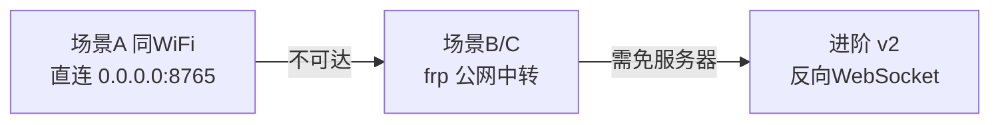

# 第 4 章 · 内网穿透网络层

## 4.1 问题

手机通常处于 NAT 后（运营商 CGNAT、家庭路由 NAT），电脑无法直接访问手机的 `127.0.0.1:8765`。需要一条通道把手机的本地端口「暴露」到电脑可达的地址。

穿透层只做字节转发，不解析业务，是「透明管道」。

## 4.2 场景分类

不同使用场景，穿透方案不同：

| 场景 | 手机与电脑关系 | 推荐方案 |
| ------ | ---------------- | ---------- |
| A. 同一局域网（家用） | 同 WiFi | **直连**，无需穿透 |
| B. 不同网络，都有公网入口 | 手机能联公网 | **反向隧道**（手机主动连电脑/公网中转） |
| C. 手机仅 4G/5G，电脑在家 | 手机无公网 IP | **公网中转服务器**（frps / Cloudflare Tunnel） |
| D. 极简临时调试 | USB 连电脑 | **adb reverse**（USB 反向代理） |

## 4.3 方案对比

### 4.3.1 frp（推荐）

- **原理**：手机跑 `frpc`（客户端）主动连接公网 `frps`（服务端），`frps` 把端口暴露出来，电脑连 `frps` 的端口即转发到手机。
- **优点**：成熟、跨平台、支持 TCP/HTTP/HTTPS、可加密压缩。
- **手机端运行**：用 Termux 跑 `frpc`，或肉包内嵌 frp 核心库（较重）。
- **结论**：**场景 B/C 主选**。

```
手机 frpc --8765 --> 公网 frps:6000 --> 电脑访问 frps:6000
```

### 4.3.2 Cloudflare Tunnel（cloudflared）

- **原理**：手机跑 `cloudflared tunnel`，Cloudflare 分配一个公网域名，电脑访问该域名。
- **优点**：免公网服务器、自带 HTTPS、免费。
- **缺点**：国内访问 Cloudflare 不稳定；手机跑 cloudflared 需要 Termux + 较多依赖。
- **结论**：海外用户可选，国内不推荐。

### 4.3.3 反向 WebSocket（自研轻量）

- **原理**：肉包主动用 WebSocket 连接电脑端 MoFox 暴露的 `ws://brain:9000/phone`，之后 MoFox 通过该 WS 下发指令，肉包回传结果。
- **优点**：无需公网服务器（只要电脑有公网 IP 或也在 frp 后），手机主动出站，绕过入站 NAT。
- **缺点**：需要改 API 传输层（不再是纯 HTTP），MoFox 侧需有 WS Server。
- **结论**：**进阶方案**，第 9 章路线图列为 v2。

### 4.3.4 adb reverse（仅调试）

```
adb reverse tcp:8765 tcp:8765
```

电脑访问 `localhost:8765` 即手机 `8765`。仅 USB 调试用，非生产方案。

### 4.3.5 局域网直连

同一 WiFi 下，手机 Server 监听 `0.0.0.0:8765`，电脑直接访问 `http://<手机IP>:8765`。最简单，**家用首选**。

## 4.4 推荐组合

根据用户场景，推荐分层递进：



**本期 v1 实现**：直连 + frp 两种，覆盖 90% 场景。

## 4.5 frp 部署细节

### 4.5.1 公网服务器（frps）

`frps.toml`：

```toml
bindPort = 7000
auth.token = "<强随机字符串>"
# 可选：Dashboard
webServer.addr = "0.0.0.0"
webServer.port = 7500
webServer.user = "admin"
webServer.password = "<密码>"
```

### 4.5.2 手机侧（frpc，Termux 运行）

`frpc.toml`：

```toml
serverAddr = "<公网IP>"
serverPort = 7000
auth.token = "<同上>"

[[proxies]]
name = "roubao-api"
type = "tcp"
localIP = "127.0.0.1"
localPort = 8765
remotePort = 6000
```

手机执行 `./frpc -c frpc.toml`，电脑即可访问 `http://<公网IP>:6000`。

### 4.5.3 电脑侧（MoFox 配置）

MoFox 的 `Phone Adapter` 配置中填写：

```toml
[phone]
base_url = "http://<公网IP>:6000"
token = "<见第7章>"
```

## 4.6 安全增强

穿透后手机端口暴露在公网，必须叠加安全措施（详见第 7 章）：

1. **frp 自身**：`auth.token` 防止他人接入；可启用 `tls.enable`。
2. **肉包 API 鉴权**：所有接口要求 `Authorization: Bearer <token>`，Token 在肉包设置页生成。
3. **HTTPS**：若用 frp 的 HTTPS 插件或 Cloudflare，链路加密；直连场景可在肉包启用自签证书（但 Android 信任链复杂，起步用 HTTP + Token + frp 加密）。
4. **IP 白名单**：肉包可配置允许的客户端 IP 列表（直连场景有用；frp 中转场景所有请求来自 frps，白名单作用有限）。
5. **端口随机化**：frps 的 `remotePort` 用高位随机端口，减少扫描命中。

## 4.7 保活与重连

手机端穿透进程容易被系统杀死，需保活：

| 手段 | 适用 | 说明 |
| ------ | ------ | ------ |
| 肉包前台 Service | 必做 | HTTP Server 本身以前台 Service 运行，通知栏常驻 |
| Termux 前台通知 | frpc 场景 | `termux-wake-lock` + 前台 Service |
| WorkManager 周期检查 | 补充 | 每 15 分钟检查 frpc 是否存活，否则拉起 |
| 用户引导 | 首次 | 设置页引导用户关闭电池优化、锁定后台 |

frpc 断线重连：frp 自带重连，默认 30s 退避，可配置 `transport.heartbeatInterval` / `transport.heartbeatTimeout`。

## 4.8 延迟与带宽

- **延迟**：直连 < 5ms；frp 中转 ≈ RTT×2（手机→frps→电脑），国内公网服务器约 30-80ms。截图 + VLM 决策一轮约 1-3s，穿透延迟占比可接受。
- **带宽**：单张 1080p PNG ≈ 1-2MB；JPEG quality=70 缩放 0.5 约 100-200KB。4G 上行带宽够用，但流量敏感用户应压缩。
- **优化**：MoFox 侧可缓存上一帧截图，仅当 VLM 需要时才重新截图；肉包可支持「区域截图」接口（仅返回指定矩形）减少传输，列为 v2。

## 4.9 与肉包的集成方式

穿透工具（frpc）**不内嵌进肉包 App**，原因：

- frp 是 Go 实现，嵌入 Android 需打包二进制，体积大。
- Termux 方案更灵活，用户可自行选择穿透工具。

肉包的职责仅是：

- HTTP Server 监听 `0.0.0.0:8765`（而非仅 `127.0.0.1`），允许本机其他进程访问。
- 设置页提供「穿透配置指引」（文档式），不直接管理 frpc。

肉包内嵌一个**可选的连接状态检查**：定时尝试连接配置的「回显地址」（frp 暴露后的公网地址），在 UI 显示穿透是否通畅。

## 4.10 本章小结

穿透层推荐「同 WiFi 直连 + frp 公网中转」双方案，frp 部署在 Termux，肉包只负责起 HTTP Server。安全依赖第 7 章的 Token 鉴权与 frp 自身加密。下一章讨论电脑端 MoFox 如何通过 Adapter + Tool 插件消费这套 API。
