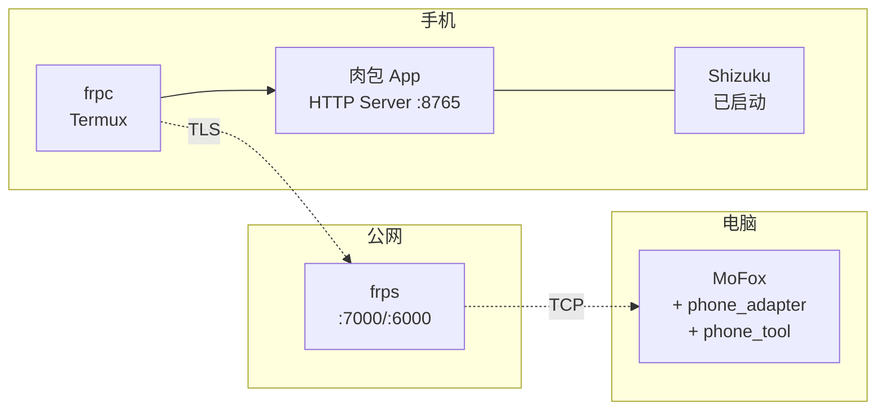

# 第 8 章 · 部署与运维

## 8.1 部署拓扑总览



三处需部署：手机端、公网中转（可选）、电脑端。

## 8.2 手机端部署

### 8.2.1 前置条件

1. Android 8.0 (API 26) 及以上。
2. 已安装并启动 Shizuku（无线调试或电脑 ADB 启动一次）。
3. 已安装肉包 APK 并授予 Shizuku 权限。
4. （frp 场景）已安装 Termux。

### 8.2.2 肉包配置步骤

1. 打开肉包 -> 设置 -> 「远程受控」。
2. 开启「启用 HTTP Server」。
3. 设置端口（默认 8765）、绑定地址（直连选 `0.0.0.0`，仅 frp 选 `127.0.0.1`）。
4. 生成 Token，复制保存。
5. （可选）开启「允许远程 Shell」「配置敏感包名」。
6. 启动服务，通知栏出现「肉包受控中」常驻通知。

### 8.2.3 frpc 部署（Termux）

```bash
# Termux 中
pkg install wget tar
wget https://github.com/fatedier/frp/releases/download/v0.61.0/frp_0.61.0_linux_arm64.tar.gz
tar -xzf frp_0.61.0_linux_arm64.tar.gz
cd frp_0.61.0_linux_arm64
```

编辑 `frpc.toml`（见第 4 章），然后：

```bash
termux-wake-lock          # 防止休眠
nohup ./frpc -c frpc.toml > frpc.log 2>&1 &
```

可选：写一个 `~/.termux/boot/` 启动脚本实现开机自启（需安装 Termux:Boot）。

### 8.2.4 保活清单

| 项 | 操作 | 必要性 |
| ---- | ------ | -------- |
| 肉包前台通知 | 服务启动后自动出现 | 必做 |
| Shizuku 常驻 | 无线调试需系统保持，Root 模式更稳 | 必做 |
| Termux wake lock | `termux-wake-lock` | frp 场景必做 |
| 关闭电池优化 | 设置 -> 应用 -> 肉包/Termux -> 不优化 | 推荐 |
| 锁定后台 | 最近任务卡片锁定 | 推荐 |
| Termux:Boot | 开机自启 frpc | 可选 |

## 8.3 公网中转部署（frps）

在一台公网服务器上：

```bash
wget https://github.com/fatedier/frp/releases/download/v0.61.0/frp_0.61.0_linux_amd64.tar.gz
tar -xzf frp_0.61.0_linux_amd64.tar.gz
cd frp_0.61.0_linux_amd64
```

`frps.toml`（见第 4 章），systemd 托管：

```ini
# /etc/systemd/system/frps.service
[Unit]
Description=frp server
After=network.target

[Service]
Type=simple
ExecStart=/path/to/frps -c /path/to/frps.toml
Restart=always
RestartSec=5

[Install]
WantedBy=multi-user.target
```

```bash
systemctl enable --now frps
```

防火墙放行 `7000`（控制端口）与 `6000`（业务端口）。

## 8.4 电脑端部署（MoFox）

### 8.4.1 安装 MoFox

参考 Neo-MoFox README，用 Launcher 或命令行部署：

```bash
git clone <Neo-MoFox repo>
cd Neo-MoFox
uv run main.py   # 首次运行生成配置
```

### 8.4.2 安装手机控制插件

把本仓库 `docs/architecture/` 设计的 `phone_adapter` 与 `phone_tool` 两个插件目录放入 MoFox 的 `plugins/`：

```
Neo-MoFox/plugins/
├── phone_adapter/    # 新增
└── phone_tool/       # 新增
```

### 8.4.3 配置

编辑 `config/plugins/phone_adapter.toml`（见第 5 章）：

```toml
[connection]
base_url = "http://<公网IP>:6000"   # 或同 WiFi 时的手机 IP
token = "<肉包生成的 Token>"
timeout = 30
```

### 8.4.4 启动与验证

```bash
uv run main.py
```

在 MoFox 控制台输入 `/plugins` 确认两个插件已加载，`/status` 查看 `phone_adapter` 是否 online。

或直接用 curl 验证链路：

```bash
curl -H "Authorization: Bearer <token>" http://<公网IP>:6000/api/system/ping
```

## 8.5 配置项汇总

### 肉包侧 `config/server.toml`

见第 7.9 节。

### MoFox 侧

| 文件 | 用途 |
|------|------|
| `config/plugins/phone_adapter.toml` | 连接、心跳、平台身份 |
| `config/plugins/phone_tool.toml` | Tool 行为开关（如是否启用 `phone_shell`） |

`phone_tool.toml` 示例：

```toml
[tools]
enabled = [
  "phone_screenshot", "phone_tap", "phone_swipe",
  "phone_input_text", "phone_open_app", "phone_search_apps"
]
disabled = ["phone_shell"]          # 默认禁用 shell 工具

[safety]
input_max_length = 500
confirm_keywords = ["密码", "验证码", "转账", "支付"]
```

## 8.6 日常运维

### 8.6.1 健康检查

MoFox 侧 `phone_adapter` 每 30s ping 一次，连续 3 次失败标记 offline，并通过事件总线通知其他插件。用户可在 MoFox 控制台 `/status` 查看。

肉包侧前台通知显示「已连接客户端数」与「最近请求时间」，用户可直观感知。

### 8.6.2 日志位置

| 端 | 路径 | 内容 |
| ---- | ------ | ------ |
| 肉包 | `/data/data/com.roubao.autopilot/files/audit/` | 审计日志 |
| 肉包 | logcat（`adb logcat -s RoubaoHttp`） | 运行日志 |
| frpc | `~/frpc.log`（Termux） | 穿透日志 |
| frps | systemd journal (`journalctl -u frps`) | 服务日志 |
| MoFox | MoFox 日志目录 | 插件日志 |

### 8.6.3 常见故障

| 现象 | 排查 |
| ------ | ------ |
| MoFox ping 超时 | 检查 frpc 是否存活、frps 防火墙、Token 是否一致 |
| 截图返回 503 | Shizuku 未启动，重新启动 Shizuku |
| tap 无反应 | 坐标是否基于原图尺寸；屏幕是否旋转 |
| 操作到一半中断 | 手机休眠/被杀，开启 wake lock + 前台通知 |
| Token 失效 | 肉包设置页重新生成并更新 MoFox 配置 |
| frp 连接频繁断开 | 调整 `transport.heartbeatInterval`，检查网络稳定性 |

### 8.6.4 升级流程

1. **肉包升级**：替换 APK，配置与 Token 持久化不丢；新版本若改 API 契约，需同步升级 MoFox 插件。
2. **MoFox 插件升级**：替换 `plugins/phone_*` 目录，`/reload phone_adapter` 热加载（利用 MoFox 现有 reload 能力）。
3. **API 版本兼容**：肉包 `ping` 返回版本号，MoFox 侧适配。

## 8.7 资源占用参考

| 端 | CPU | 内存 | 流量/次截图 |
| ---- | ----- | ------ | ------------- |
| 肉包 HTTP Server（空闲） | < 1% | ~15MB | - |
| 肉包（活跃任务） | 10-30%（含 VLM） | 50-150MB | - |
| frpc | < 1% | ~10MB | - |
| JPEG quality=70 scale=0.5 截图 | - | - | ~150KB |
| PNG 原图（1080p） | - | - | ~1.5MB |

## 8.8 本章小结

部署分手机端（肉包 + Shizuku + 可选 frpc）、公网中转（frps，可选）、电脑端（MoFox + 两插件）三处。家用同 WiFi 可省去公网中转。运维依赖 MoFox 的 ping 心跳与肉包前台通知，故障排查有明确路径。下一章给出开发路线图。
